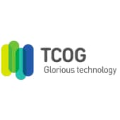
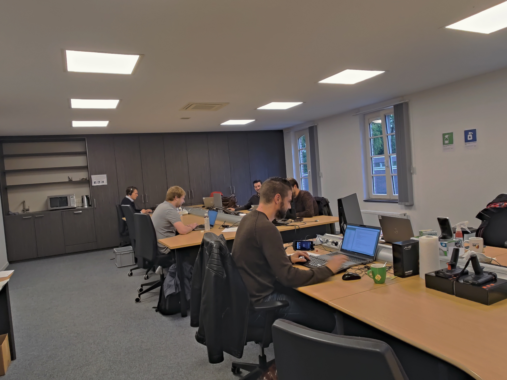
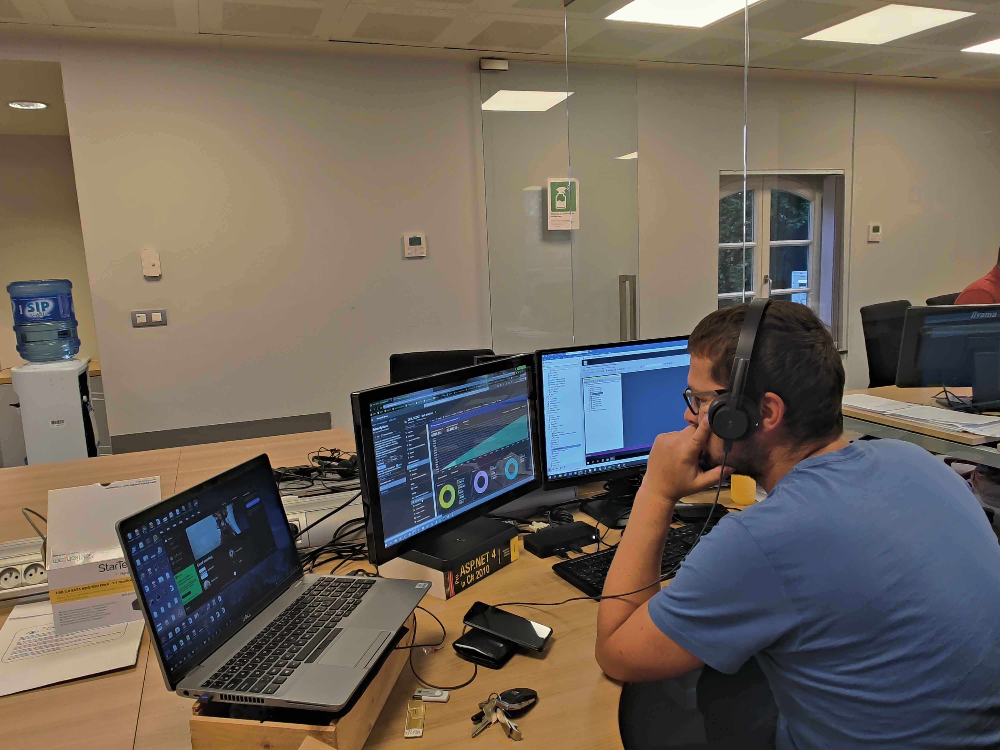

# Dagverslagen

* [Dag 1  2021-10-04](#2021-10-04)
* [Dag 2  2021-10-05](#2021-10-05)
* [Dag 3  2021-10-06](#2021-10-06)
* [Dag 4  2021-10-07](#2021-10-07)
* [Dag 5  2021-10-08](#2021-10-08)

## 2021-10-04

 
Vandaag heb ik kennis gemaakt met de werknemers en hun functie, een rondleiding gekregen. Ik heb ook de hele dag bij de helpdesk gezeten en mee gevolgd met de cases en de Issues van acco (een grote winkel voor studenteboeken). Ik heb ook informatie gekregen over de software die in de onderneming gebruikt wordt. We hebben ook gekeken naar een kassa van de aveve en de software erachter samen met een consultant van aveve.

## 2021-10-05

 
Vandaag zijn we in de voormiddag meegegaan met een consultant naar een klant om ze zo proberen te overtuigen om hun versie van navision up te daten naar buisiness central en al de voordelen ervan uitgelgd, zijn ze ook gaan bedanken omdat ze al 15 jaar klant zijn. Daarna hebben we een case gevolgd aan de helpdesk van een winkel die een extra knop nodig had op een kassa voor te betalen met een speciale krediet kaart. In de namiddag hebben we eerst een uitleg en voorstelling gekregen van een software ontwikkelaar over de software die ze gebruiken om apps voor buisiness central te maken en hoe ze deze uittesten en tot aan de klant bezorgen.
We zijn ook nog gaan kijken naaar de administratie naar hun taken.

## 2021-10-06

 
we hebben vandaag heel veel informatie gekregen. in de voormiddag zijn we naar de marketing afdeling gaan kijken naar hun taken en fotos gaan nemen rond het bedrijf voor de fotoreportage van frans. daarna hebben we een meeting mogen meevolgen over azure en de beveiliging van het bedrijf. in de namiddag hebben we een hele tijd samen gezeten met een programeur die een voor een klant was aan het programmeren. tijdens het programeren legde hij alles uit en ook de denkwijze die hij gebruikt voor tot op de code te komen, dit was heel interresant want we konden zien hoe het programeren werd gebruikt als echt een opdracht van een klant moest gedaan worden. Dit gebeurde allemaal in Visual studio code en ook in een container waar virtuele machines in staan zodat je de code kan testen of het werkt.

## 2021-10-07

 
We hebben vandaag in de voormiddag aan de helpdesk gezeten en meegeluisterd met binnenkomende cases. in de namiddag hebben we informatie gekregen over de programatie achter een scanner die ze in een magazijn gebruiken. We hebben gezien hoe ze dit programeren en in welke taal ze dit doen.
daarna mochten we een maandelijks meeting meevolgen en zijn we een kijkje gaan nemen in de server ruimte, deze is maar klein aangezien ze bezig zijn met zo veel mogelijk op de cloud te zetten.

## 2021-10-08

 

We zijn vandaag begonnen met een klein cadeautje te geven aan de medewerkers voor hen te bedanken voor de fantastis leerijke en toffe stage. Daarna hebben we een samenvatting van DevOps laten nakijken door de persoon die de uitleg had gegeven en hij heeft nog extra info gegeven. Voor de rest van de dag hebben we de technical consultant / interne IT gezeten. Hij heeft powershell en zijn werk uitgebreid uitgelegd en dit was heel interresant hoe hij ook de servers beheert.

