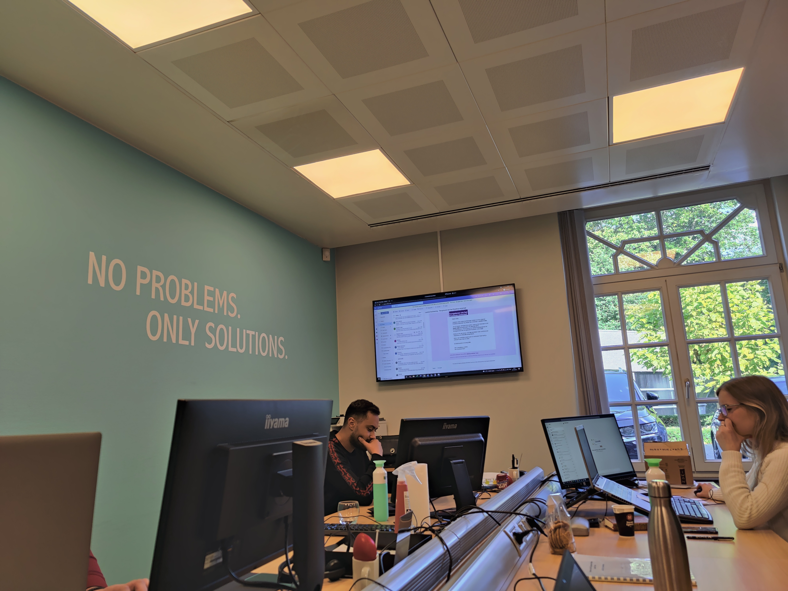
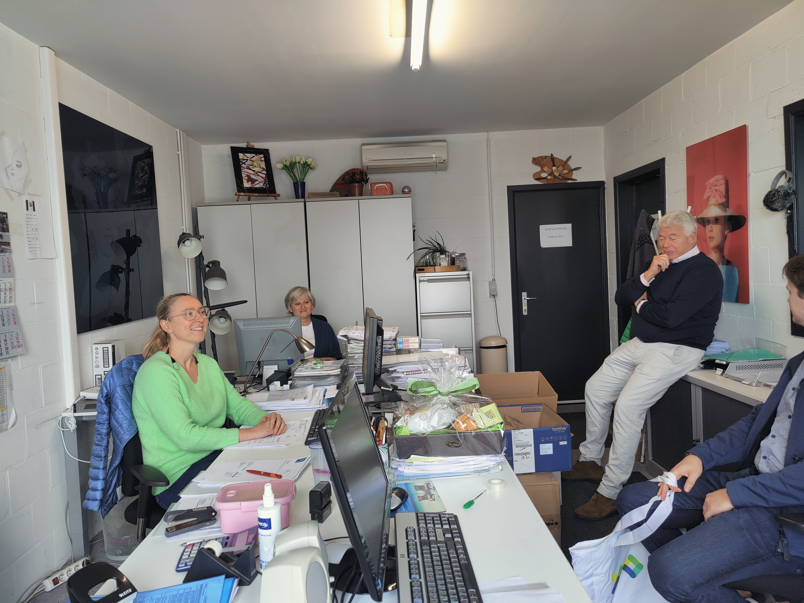

# Dagverslagen

* [Dag 1  2021-10-04](#2021-10-04)
* [Dag 2  2021-10-05](#2021-10-05)

## 2021-10-04

 
Vandaag heb ik kennis gemaakt met de werknemers en hun functie, een rondleiding gekregen. Ik heb ook de hele dag bij de helpdesk gezeten en mee gevolgd met de cases en de Issues van acco (een grote winkel voor studenteboeken). Ik heb ook informatie gekregen over de software die in de onderneming gebruikt wordt. We hebben ook gekeken naar een kassa van de aveve en de software erachter samen met een consultant van aveve.

## 2021-10-05

 
Vandaag zijn we in de voormiddag meegegaan met een consultant naar een klant om ze zo proberen te overtuigen om hun versie van navision up te daten naar buisiness central en al de voordelen ervan uitgelgd, zijn ze ook gaan bedanken omdat ze al 15 jaar klant zijn. Daarna hebben we een case gevolgd aan de helpdesk van een winkel die een extra knop nodig had op een kassa voor te betalen met een speciale krediet kaart. In de namiddag hebben we eerst een uitleg en voorstelling gekregen van een software ontwikkelaar over de software die ze gebruiken om apps voor buisiness central te maken en hoe ze deze uittesten en tot aan de klant bezorgen.
We zijn ook nog gaan kijken naaar de administratie naar hun taken.

